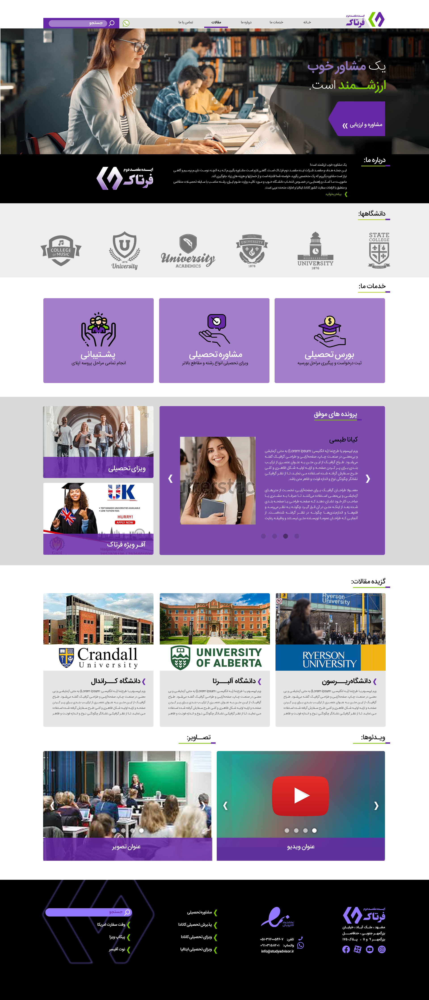

# BetterTravel Frontend code challenge

### Requirements

**Project rules**

- This project needs to be delivered only in **24 hours.**
- Create a public Github project in your personal account and send link to us
- Focus on quality and amount of work together
- Usage of **AI is allowed**
- List of libraries/frameworks that is allowed:
  - React
  - Vue.js
  - Tailwind
  - Bootstrap
  - Pure HTML/CSS
  - Less
  - Sass
- **Submit project as much as you can**. Do not try to implement all elements
- I wish you a very good luck
## Todo:

Try to implement below template
